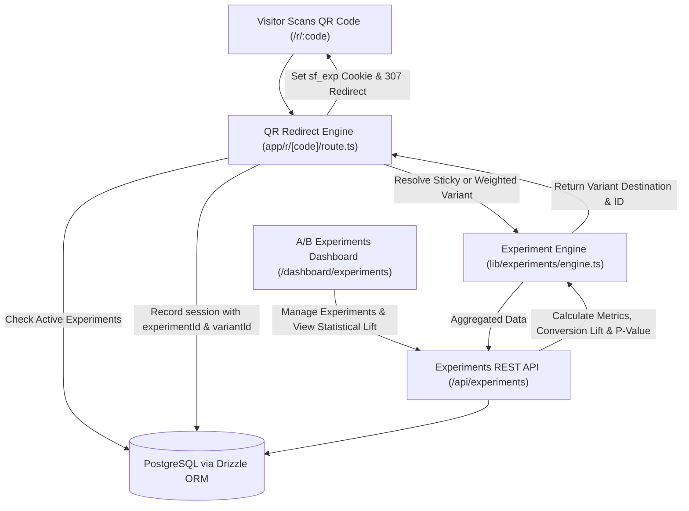

# Feature 12: A/B Testing Engine — Design Specification

## Overview

Feature 12 provides a complete A/B split-testing engine for ScanFlow. It enables users to distribute traffic from a single dynamic QR code between multiple destinations (e.g. 50% Variant A vs 50% Variant B), maintain sticky visitor variant assignment across repeat scans, track variant conversion rates in real-time, compute statistical confidence (p-value & Chi-Square), calculate conversion lift, and declare winning destinations.

---

## 1. System Architecture



---

## 2. Database Schema (`lib/db/schema.ts`)

### `experiments` Table
```typescript
export const experiments = pgTable("experiments", {
  id: text("id").primaryKey(),
  userId: text("user_id")
    .notNull()
    .references(() => user.id, { onDelete: "cascade" }),
  qrCodeId: text("qr_code_id")
    .notNull()
    .references(() => qrCodes.id, { onDelete: "cascade" }),
  campaignId: text("campaign_id").references(() => campaigns.id, { onDelete: "set null" }),
  name: text("name").notNull(),
  description: text("description"),
  status: text("status").default("draft").notNull(), // 'draft', 'active', 'paused', 'ended'
  trafficAllocation: integer("traffic_allocation").default(100).notNull(), // % of total traffic in test (1-100)
  winnerVariantId: text("winner_variant_id"),
  startedAt: timestamp("started_at"),
  endedAt: timestamp("ended_at"),
  createdAt: timestamp("created_at").defaultNow().notNull(),
  updatedAt: timestamp("updated_at").defaultNow().notNull(),
});
```

### `experiment_variants` Table
```typescript
export const experimentVariants = pgTable("experiment_variants", {
  id: text("id").primaryKey(),
  experimentId: text("experiment_id")
    .notNull()
    .references(() => experiments.id, { onDelete: "cascade" }),
  userId: text("user_id")
    .notNull()
    .references(() => user.id, { onDelete: "cascade" }),
  name: text("name").notNull(), // e.g. "Variant A (Control)", "Variant B (Promo)"
  destinationUrl: text("destination_url").notNull(),
  trafficWeight: integer("traffic_weight").default(50).notNull(), // % weight (must sum to 100)
  isControl: boolean("is_control").default(false).notNull(),
  createdAt: timestamp("created_at").defaultNow().notNull(),
  updatedAt: timestamp("updated_at").defaultNow().notNull(),
});
```

### Schema Extensions to `sessions` & `session_events`
- `experimentId`: `text("experiment_id").references(() => experiments.id, { onDelete: "set null" })`
- `experimentVariantId`: `text("experiment_variant_id").references(() => experimentVariants.id, { onDelete: "set null" })`

---

## 3. Assignment & Statistical Engine (`lib/experiments/engine.ts`)

### Functions:
1. `selectExperimentVariant(variants, existingCookieVariantId, visitorSeed)`:
   - If `existingCookieVariantId` matches a valid variant, return it (sticky session).
   - Otherwise, generate a weighted pseudo-random or hash-based selection based on `trafficWeight`.
2. `calculateStatisticalSignificance(controlSessions, controlConversions, variantSessions, variantConversions)`:
   - Computes Chi-Square statistic ($ \chi^2 $) for the $2 \times 2$ contingency table.
   - Computes $p$-value and Confidence Level ($ (1 - p) \times 100\% $).
   - Returns:
     - `confidenceLevel`: number (e.g. 96.5%)
     - `isSignificant`: boolean (`confidenceLevel >= 95.0`)
     - `pValue`: number
     - `lift`: percentage difference $ \frac{\text{variantRate} - \text{controlRate}}{\text{controlRate}} \times 100\% $

---

## 4. REST API (`/api/experiments`)

- `GET /api/experiments`: List experiments with real-time variant metrics (`scans`, `sessions`, `conversions`, `conversionRate`, `lift`, `confidenceLevel`).
- `POST /api/experiments`: Create experiment with variants (enforces variant weights sum to 100%).
- `GET /api/experiments/[id]`: Detailed experiment statistics.
- `PATCH /api/experiments/[id]`: Update status (`active`, `paused`, `ended`), winner, or details.
- `DELETE /api/experiments/[id]`: Delete experiment.

---

## 5. UI Architecture (`app/dashboard/experiments/page.tsx`)

- **Header KPI Cards**:
  - Total Experiments
  - Active Experiments
  - Total Experiment Traffic (Scans)
  - Top Conversion Lift (%)
- **Experiment Cards Grid**:
  - Status toggle buttons (Start, Pause, End).
  - Side-by-side variant comparison cards with conversion rate progress bars and lift badges.
  - Statistical confidence indicator (`95%+ Confident 🏆` vs `Collecting Data`).
  - Action dropdown (Edit, Declare Winner, Delete).
- **Creation Dialog (`components/experiments/experiment-dialog.tsx`)**:
  - QR Code selector, Name, Description, Variant A & Variant B destination URLs and split weights (`50/50`, `70/30`, `80/20`).

---

## 6. Testing & Verification

1. **Schema & Relations Tests (`tests/unit/schema.test.ts`)**.
2. **Engine Tests (`tests/unit/experiments-engine.test.ts`)**: Variant selection, weighted distribution, Chi-Square calculation, confidence level.
3. **Redirect Integration Tests (`tests/unit/redirect.test.ts`)**: Routing through active experiments, setting sticky cookies.
4. **API Tests (`tests/unit/experiments-api.test.ts`)**: Multi-tenant CRUD and statistics.
5. **Component & Page Tests (`tests/unit/experiments-components.test.tsx`, `tests/unit/experiments-page.test.tsx`)**.
6. **Full Test Suite (`npm run test`)** verifying 100% pass rate.
