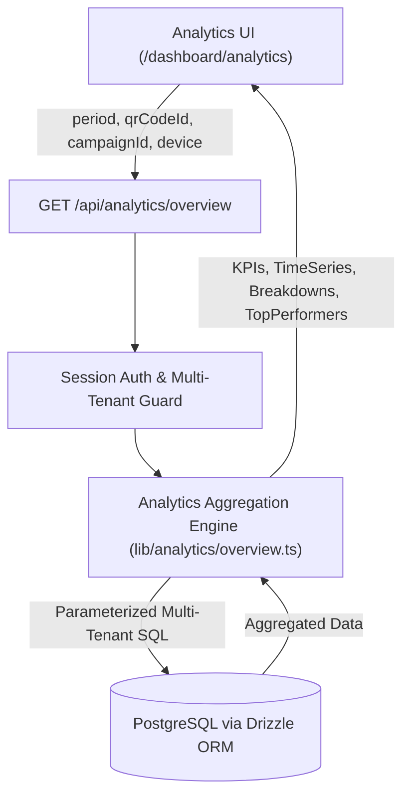

# Feature 10: Analytics Deep-Dive — Design Specification

## Overview

Feature 10 provides a dedicated, high-performance Analytics Deep-Dive dashboard (`/dashboard/analytics`) and unified aggregation API endpoint (`GET /api/analytics/overview`) for ScanFlow. It enables users to explore detailed performance metrics across time ranges, devices, operating systems, browsers, geographic locations, time of day, and comparative campaign/QR performance.

---

## 1. System Architecture



---

## 2. API Design & Data Contract

### Endpoint
`GET /api/analytics/overview`

### Query Parameters
- `period` (optional): `'24h'` (default), `'7d'`, `'30d'`, `'90d'`, `'all'`
- `qrCodeId` (optional): Specific QR code UUID or `'all'` (default)
- `campaignId` (optional): Specific Campaign UUID or `'all'` (default)
- `device` (optional): Specific device type filter: `'all'`, `'mobile'`, `'desktop'`, `'tablet'`

### Response Schema
```typescript
export interface AnalyticsOverviewData {
  kpis: {
    totalScans: number;
    uniqueVisitors: number;
    totalSessions: number;
    conversions: number;
    conversionRate: number; // percentage (0 - 100)
    avgDurationSeconds: number;
    bouncedSessions: number;
    bounceRate: number; // percentage (0 - 100)
  };
  timeSeries: Array<{
    timestamp: string; // ISO date / hour key
    label: string; // Formatted date/time label (e.g. "14:00", "Aug 12")
    scans: number;
    sessions: number;
    conversions: number;
  }>;
  breakdowns: {
    devices: Array<{ name: string; value: number; percentage: number }>;
    operatingSystems: Array<{ name: string; value: number; percentage: number }>;
    browsers: Array<{ name: string; value: number; percentage: number }>;
    countries: Array<{ code: string; name: string; scans: number; percentage: number }>;
    cities: Array<{ name: string; country: string; scans: number; percentage: number }>;
    hourlyDistribution: Array<{ hour: number; label: string; count: number }>;
  };
  topPerformers: {
    qrCodes: Array<{
      id: string;
      name: string;
      slug: string;
      scans: number;
      sessions: number;
      conversions: number;
      conversionRate: number;
    }>;
    campaigns: Array<{
      id: string;
      name: string;
      scans: number;
      sessions: number;
      conversions: number;
      conversionRate: number;
    }>;
  };
}
```

---

## 3. Aggregation Engine (`lib/analytics/overview.ts`)

### Logic Breakdown
1. **Time Filtering**:
   - `24h`: `now - 24 hours` (1-hour buckets)
   - `7d`: `now - 7 days` (1-day buckets)
   - `30d`: `now - 30 days` (1-day buckets)
   - `90d`: `now - 90 days` (3-day or 1-day buckets)
   - `all`: All recorded history for the user (1-month or 1-week buckets)

2. **Tenant Isolation**:
   - Every SQL query requires `where(and(eq(sessions.userId, userId), ...))`.

3. **Metrics Calculation**:
   - `uniqueVisitors`: Count of distinct `ipHash` values.
   - `bounceRate`: Percentage of sessions where `eventsCount === 1`.
   - `conversionRate`: `(conversions / totalSessions) * 100`.
   - `avgDurationSeconds`: `sum(durationSeconds) / count(sessions)`.

4. **Breakdown Computations**:
   - Frequency counts grouped by `deviceType`, `os`, `browser`, `country`, `city`, and `EXTRACT(HOUR FROM startedAt)`.

---

## 4. User Interface (`app/dashboard/analytics/page.tsx`)

### Layout Components
1. **Header & Control Bar**:
   - Time window pill toggle (`24h`, `7d`, `30d`, `90d`, `all`).
   - Campaign filter dropdown.
   - QR Code filter dropdown.
   - Device type filter dropdown.
   - Quick Export menu (`Export JSON`, `Export CSV`).
   - Manual refresh trigger.

2. **Summary KPI Grid (4 Cards)**:
   - Total Scans & Unique Visitors.
   - Sessions & Bounce Rate.
   - Conversions & Conversion Rate.
   - Average Session Duration.

3. **Volume Trend Chart**:
   - Interactive Recharts Area/Bar chart displaying Scans, Sessions, and Conversions.

4. **Multi-Dimension Breakdown Cards**:
   - **Devices & OS**: Donut chart + breakdown progress bars.
   - **Browsers**: Ranked bar chart.
   - **Geographic Insights**: Ranked country & city list with percentage indicators.
   - **Time of Day Activity**: 24-hour bar distribution.

5. **Top Performers Section**:
   - **Top QR Codes**: Table listing name, slug, scans, sessions, conversions, conversion rate.
   - **Top Campaigns**: Table listing campaign name, status, QR count, total scans, conversions, conversion rate.

---

## 5. Verification & Testing

1. **Unit Tests (`tests/unit/analytics-overview-api.test.ts`)**:
   - Test `GET /api/analytics/overview` with no query parameters.
   - Test period filtering (`24h`, `7d`, `30d`, `all`).
   - Test `qrCodeId`, `campaignId`, and `device` filtering.
   - Verify multi-tenant isolation (user A cannot see user B's metrics).
   - Test zero-data empty state handling.

2. **Component Tests (`tests/unit/analytics-components.test.tsx`)**:
   - Test `/dashboard/analytics` page rendering with mock API response.
   - Test filter changing and loading state indicators.
   - Test export action triggers.

3. **Full Regression Test**:
   - Execute `npm run test` across all 20+ test suites.
