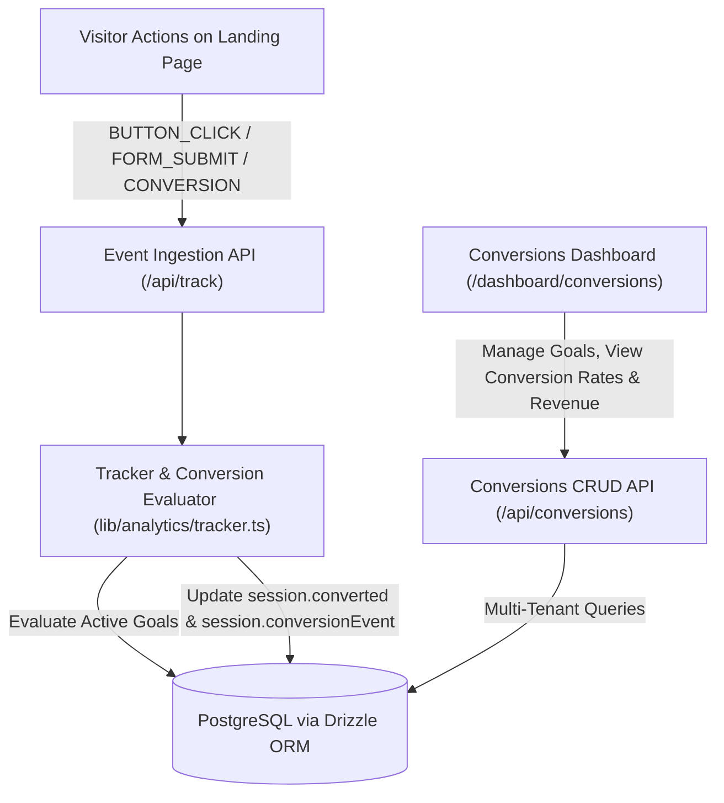

# Feature 11: Conversion Tracking — Design Specification

## Overview

Feature 11 adds an end-to-end Conversion Tracking system to ScanFlow, allowing users to define custom conversion goals (e.g. "Order Now Click", "Menu Download", "Form Submit"), associate them with QR codes or campaigns, automatically evaluate incoming scan/session events, calculate real-time conversion rates (`Conversions / Sessions * 100`), attribute monetary value/revenue, and manage goals in a dedicated dashboard (`/dashboard/conversions`).

---

## 1. System Architecture



---

## 2. Database Schema (`conversion_goals`)

Add table `conversion_goals` to `lib/db/schema.ts`:

```typescript
export const conversionGoals = pgTable("conversion_goals", {
  id: text("id").primaryKey(),
  userId: text("user_id")
    .notNull()
    .references(() => user.id, { onDelete: "cascade" }),
  name: text("name").notNull(), // e.g. "Order Now Click", "Menu Download"
  description: text("description"),
  eventType: text("event_type").notNull(), // 'BUTTON_CLICK', 'LINK_CLICK', 'FORM_SUBMIT', 'PAGE_VIEW', 'CONVERSION'
  targetPattern: text("target_pattern"), // optional matching pattern/text (e.g. "Order Now", "/checkout")
  qrCodeId: text("qr_code_id").references(() => qrCodes.id, { onDelete: "set null" }), // optional QR scope
  campaignId: text("campaign_id").references(() => campaigns.id, { onDelete: "set null" }), // optional Campaign scope
  monetaryValue: integer("monetary_value").default(0).notNull(), // in cents (e.g. $15.00 -> 1500)
  currency: text("currency").default("USD").notNull(),
  isActive: boolean("is_active").default(true).notNull(),
  createdAt: timestamp("created_at").defaultNow().notNull(),
  updatedAt: timestamp("updated_at").defaultNow().notNull(),
});
```

Relations:
- `user.conversionGoals` -> many `conversionGoals`
- `conversionGoals.user` -> one `user`
- `conversionGoals.qrCode` -> one `qrCodes`
- `conversionGoals.campaign` -> one `campaigns`

---

## 3. Backend REST API (`/api/conversions`)

### Endpoints
- `GET /api/conversions`:
  - Returns list of goals for authenticated tenant with aggregate stats:
    - `totalConversions`: count of sessions where `converted === true` matching this goal
    - `totalSessions`: count of relevant sessions in scope
    - `conversionRate`: percentage `(totalConversions / totalSessions) * 100`
    - `totalRevenue`: `(totalConversions * monetaryValue) / 100`
- `POST /api/conversions`:
  - Body: `{ name, description?, eventType, targetPattern?, qrCodeId?, campaignId?, monetaryValue?, currency?, isActive? }`
  - Validates input and creates new goal with generated ID.
- `GET /api/conversions/[id]`:
  - Returns goal details and matching conversions.
- `PATCH /api/conversions/[id]`:
  - Updates goal fields with tenant check.
- `DELETE /api/conversions/[id]`:
  - Deletes goal with tenant check.

---

## 4. Evaluation Engine (`lib/analytics/tracker.ts`)

When an event is recorded via `recordSessionEvent`:
1. Retrieve active `conversionGoals` for `session.userId`.
2. Check if the event matches any active goal by:
   - `eventType` matches `goal.eventType` (or goal is wildcard / generic `CONVERSION`)
   - `qrCodeId` matches `goal.qrCodeId` (if goal is scoped to specific QR)
   - `campaignId` matches `goal.campaignId` (if goal is scoped to specific Campaign)
   - `targetPattern`: if defined, checks `eventData.goal`, `eventData.name`, `eventData.label`, `eventData.path`, or `eventData.target` for a substring / regex match.
3. If matched:
   - Set `session.converted = true`
   - Set `session.conversionEvent = goal.name`
   - Record conversion metadata in session event.

---

## 5. Frontend & UI Experience (`app/dashboard/conversions/page.tsx`)

### Navigation
- Update [`components/app-sidebar.tsx`](file:///home/amirfaisalz/Documents/amir/QR/components/app-sidebar.tsx) to add **Conversions** with `Target` icon.

### Page Components (`components/conversions/`)
1. **Summary KPI Cards**:
   - Total Conversions & Overall Conversion Rate
   - Total Attributed Revenue ($)
   - Active Conversion Goals count
2. **Filter & Action Toolbar**:
   - Search by goal name
   - Filter by status (`all`, `active`, `paused`)
   - "New Goal" button triggering goal creation dialog
   - "Tracking Snippet" button opening quick SDK code snippet
3. **Goal Cards Grid**:
   - Displays Goal name, description, trigger badge (`BUTTON_CLICK`, `FORM_SUBMIT`, etc.), pattern, scope badge, monetary value, conversion rate progress bar, and action menu (Edit, Toggle Status, Delete).
4. **Creation / Edit Dialog (`components/conversions/conversion-dialog.tsx`)**:
   - Form with input validation, event trigger select, QR & Campaign selectors, monetary value input.
5. **Client Snippet Dialog (`components/conversions/snippet-dialog.tsx`)**:
   - Interactive code block with copy button demonstrating how to track conversions from web pages.

---

## 6. Testing & Verification

1. **Schema Tests (`tests/unit/schema.test.ts`)**:
   - Validate `conversionGoals` table definition and relations.
2. **API Tests (`tests/unit/conversions-api.test.ts`)**:
   - Auth enforcement (401 when unauthorized).
   - CRUD operations (GET, POST, PATCH, DELETE).
   - Multi-tenant isolation.
   - Aggregate conversion rate calculation accuracy.
3. **Tracker Tests (`tests/unit/conversion-tracker.test.ts`)**:
   - Verify event evaluation matches goals and sets `session.converted`.
4. **Component Tests (`tests/unit/conversions-components.test.tsx`)**:
   - Test dialog submissions, card rendering, and snippet modal.
5. **Full Regression Test**:
   - `npm run test` across all 24+ test files.
