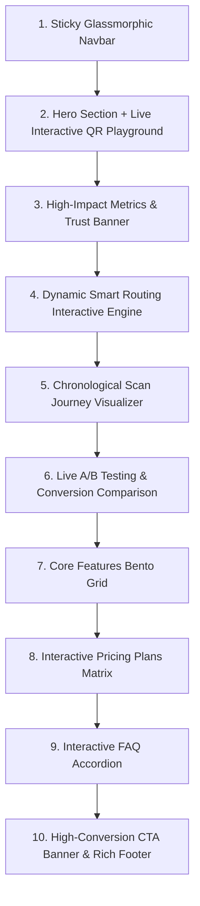

# Startup Homepage Redesign Specification

**Document**: `docs/superpowers/specs/2026-08-15-startup-homepage-design.md`  
**Status**: In Review  
**Theme**: Linear / Dark Luxe High-Tech Aesthetic (Obsidian dark, ambient lighting, precision typography, spring micro-animations, product-led live interactive demos)

---

## 1. Overview & Objectives

Transform the ScanFlow landing page from a basic brochure into a **modern, high-converting startup web experience** matching the quality of top-tier developer platforms (Linear, Vercel, Supabase, Raycast).

### Key Goals:
- **Product-Led Interactivity**: "Show, don't just tell." Visitors can interact with a live QR generator and smart routing simulator directly on the homepage.
- **Dynamic Visual Storytelling**: Explain complex concepts (dynamic device routing, visitor journey timelines, and A/B conversion testing) using interactive visualizers with subtle glowing animations.
- **Flawless Responsiveness & Aesthetics**: Deep dark obsidian palette (`#09090b`), high-contrast crisp typography, glassmorphism (`backdrop-blur`), subtle radial gradients, and fluid micro-interactions.

---

## 2. Page Architecture & Section Hierarchy

The homepage will consist of 10 curated sections:

---

## 3. Detailed Component Specifications

### 3.1 Sticky Glassmorphic Header
- **Logo**: Glowing ScanFlow icon badge + `v2.4 Live` indicator badge.
- **Navigation Links**: Features, Live Sandbox, Scan Journey, A/B Engine, Pricing, FAQ (with smooth anchor scrolling).
- **Actions**:
  - `Sign In` (ghost button)
  - `Get Started Free` / `Go to Dashboard` (glowing primary button with hover spring)
- **Mobile Menu**: Responsive slide-over sheet drawer with mobile navigation.

### 3.2 Hero Section & Live Interactive QR Playground (`components/home/hero-playground.tsx`)
- **Headline**: "Turn QR Codes into Intelligent, Programmable Entry Points."
- **Subheadline**: "Route scans dynamically by device, OS, and location. Track visitor sessions chronologically and A/B test destinations in real time."
- **Dual CTA**:
  - "Start Free Trial" (primary with subtle shimmer / glow)
  - "Explore Interactive Sandbox" (scrolls to playground)
- **Live Interactive Playground Widget**:
  - Real-time Destination URL input
  - Rule selector tabs: `Device OS Split (iOS/Android/Desktop)`, `A/B Multi-Variant (50/50)`, `Geo Location Routing`
  - Real-time QR Code preview rendered via `qrcode` canvas/SVG with color and dot customization
  - **"Simulate Scan" Interactive Modal**: Lets the user choose a simulated device (e.g., iPhone 15 Pro, Samsung Galaxy, or MacBook Chrome) and watches an animated visual log of the exact routing decision, redirect target, and recorded journey event in real-time.

### 3.3 Metrics & Trust Proof Bar
- Four key metric cards with animated pulse dots:
  - `< 12ms` Global Edge Latency
  - `99.99%` Enterprise Uptime
  - `10M+` Scans Dispatched
  - `4.8x` Avg Conversion Lift

### 3.4 Dynamic Smart Routing Interactive Visualizer (`components/home/routing-visualizer.tsx`)
- Interactive diagram showcasing multi-branch routing logic:
  - Input: Visitor Scans QR
  - Decision Logic: Device OS detection (iOS vs Android vs Web), Geo filter (US vs Global), Schedule filter
  - Destinations: App Store link, Google Play link, or Web Landing page
  - Clickable simulator tabs allowing users to test different device payloads and see the routing path illuminate with animated glowing data lines.

### 3.5 Chronological Scan Journey Timeline (`components/home/journey-visualizer.tsx`)
- Interactive step-by-step timeline reproducing the ScanFlow journey engine:
  - Step 1: Scan Recorded (IP, Device, User-Agent detected)
  - Step 2: Session Bound (Visitor session token initialized)
  - Step 3: Fast Redirect (Deterministic match executed)
  - Step 4: Pageview Tracked (Landing engagement monitoring)
  - Step 5: Conversion Goal Reached (Sign-up, checkout, or lead captured)
- Includes animated step counter and playback controls.

### 3.6 A/B Testing & Split Traffic Showcase (`components/home/ab-testing-showcase.tsx`)
- Live side-by-side comparison card:
  - Variant A vs Variant B with custom traffic weights (e.g. 50% vs 50%)
  - Simulated real-time scan meter with conversion percentage bars
  - Winner auto-selection badge ("Variant B outperformed by +38.4%").

### 3.7 Core Features Bento Grid (`components/home/feature-bento.tsx`)
- 6 High-tech cards with dark glass aesthetic and hover glow:
  1. **Dynamic Rule Orchestrator**: Condition engine with OS, Device, Geo, and UTM rules.
  2. **End-to-End Scan Journeys**: Full chronological audit trail per visitor.
  3. **Multi-Tenant Security**: Postgres-level tenant isolation and encrypted tracking keys.
  4. **Dynamic QR Customizer**: Custom hex colors, error correction, logo embedding, and SVG export.
  5. **Real-time Analytics**: Device breakdowns, country distributions, and hourly scan trends.
  6. **Zero-Latency Edge Redirection**: Sub-15ms fast redirects with automated fallback.

### 3.8 Interactive Pricing Matrix (`components/home/pricing-section.tsx`)
- Monthly / Annual toggle (with "Save 20%" badge).
- 3 Tier cards:
  - **Starter (Free)**: 1,000 scans/mo, 5 dynamic QR codes, basic analytics.
  - **Pro ($29/mo)** (Featured with neon gradient border & "Most Popular" tag): Unlimited dynamic QRs, 100k scans/mo, A/B testing engine, smart routing rules, full scan journey tracking.
  - **Enterprise (Custom)**: Custom domains, dedicated edge redirect nodes, SLA, multi-team RBAC.

### 3.9 Interactive FAQ Accordion (`components/home/faq-section.tsx`)
- Smooth animated collapsible questions covering:
  - What makes dynamic QR codes different from static QR codes?
  - Can I change the destination URL after printing the QR code?
  - How fast is the redirect latency?
  - How does the A/B testing engine work?
  - Is visitor data GDPR and privacy compliant?

### 3.10 High-Conversion CTA & Rich Startup Footer
- **CTA Card**: High-contrast dark obsidian card with ambient radial spotlight, email/register quick trigger, and feature guarantees.
- **Footer**: Brand mark, multi-column navigation (Product, Platform, Solutions, Resources, Company), legal links, and live system status badge ("🟢 All Systems Operational").

---

## 4. Animation & Design System Guidelines

- **Color Palette**: Obsidian Black (`#09090b`), Slate Zinc (`#18181b`, `#27272a`), Crisp Text (`#f4f4f5`, `#a1a1aa`), Accent Electric Blue/Violet/Cyan gradients for glows.
- **Glassmorphism**: `backdrop-blur-md bg-zinc-950/70 border border-zinc-800/80`.
- **Micro-Animations**:
  - Button hover lifts and subtle scale shifts
  - Shimmering gradient borders on featured elements
  - Smooth interactive tab switches
  - Animated pulse indicators on live data points
- **Accessibility & Performance**:
  - Full keyboard navigation support
  - Semantic HTML5 structure
  - High color contrast ratio (WCAG AA compliant)
  - Zero heavy external runtime animation dependencies (utilizing lightweight CSS animations and React state transitions).

---

## 5. Verification Plan

1. **Compilation & Lint Verification**:
   - Run `npm run lint` and `npm run build` to ensure zero TypeScript or build errors.
2. **Interactive Component Testing**:
   - Verify QR generator dynamically updates canvas/SVG upon text/color change.
   - Verify "Simulate Scan" modal opens, runs the step-by-step routing animation, and displays the correct simulated outcome.
   - Verify tab switches in Routing Visualizer, Scan Journey, A/B Testing, and Pricing sections.
   - Verify FAQ accordion open/close animations.
3. **Responsive Testing**:
   - Test on mobile (375px), tablet (768px), and desktop (1280px+) viewport breakpoints.
